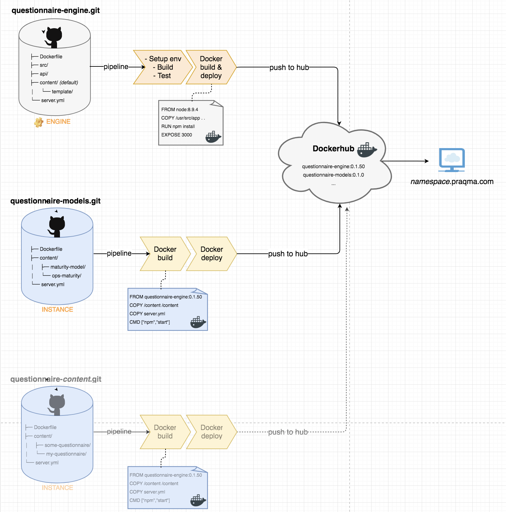

# Deployment description

`questionnaire-engine.git` is the primary repository for our questionnaire engine and contain the engine itself, both backend and front-end functionality and some example content.
The example content is there to be used for testing and to be able to spin up a complete questionnaire from this example content.

The questionnaire engine build a docker image, that is pushed to the registry and from there can be deployed to show the questionnaire example for demonstration purposes.

The most important role of the docker image though, is to serve as base image for the real production questionnaire that consist of the engine and some real content.

`maturity-model.git` is a content repository, that defines one or several questionnaires and together with the engine wil serve _real_ questionnaires to end-users.

The the picture this means we use the base engine docker image, and overwrite the example content in that image to create a new deployable questionnaire with real content.
That questionnaire image is ready for deployment.

## Further image details

Related to `questionnaire-engine.git`:

* `src/` contain the nodejs front-end application
* `api/` is the backend part of the nodejs application serving API requests
* `content/` is example content, that will work as a real questionnaire and show all aspect of what is possible
* Again the `server.yml` is the basic deployment information that is needed to deploy the engine with example content as a real questionnaire. The information in that file is used by the application itself, for example it needs to know the link to the database. _There could be information a deployment process also needs._
* The Dockerfile for this nodejs application is pretty simple, it just uses default nodejs image and then copy in the src files as this seems to be the general community way of doing it.
* Compose file - see below.

Related to `maturity-model.git`:

* This is a repository that have content for the two questionnaires _maturity-model_ and _ops-maturity-model_.
* Again the `server.yml` is the basic deployment information that is needed to deploy the engine with example content as a real questionnaire. The information in that file is used by the application itself, for example it needs to know the link to the database. _There could be information a deployment process also needs._
* When we build the docker image, we overwrite the original example content from the engine image, so we ensure we serve just the real content.
* Compose file - see below.

## A compose file because there is a database also

The questionnaire stores data in a json database, so it needs to have a connection to the database. The connection string comes from the `server.yml`.

Currently there is no requirements for any configuration of the database, it default mongodb docker image that is used.

To ensure this is part of our deployment, also for developer to be able to spin up a local instance we have a compose file that defines the questionnaire service to be both the engine image with content, and the mongodb.

## Design decisions and requirements

* _We want to separate the what from the how!_ This means the engine nodejs application shouldn't be put together with the content, nor should you be required to update anything in the engine context to deploy new content.
  * This is why we a separate repository with content, that is not related to the engine at all.
  * We have content with the engine, but only example content used to document features and to be able to run tests on and validate the demo setup when developing the engine.
* _Dependencies are managed by either git submodules or docker images!_ We want to have only one engine, and re-use that. We also want to be able to update the engine for some questionnaire to get new features, but not necessarily for all questionnaires we have in production. Further we want to be able to have several questionnaires maintained and managed together, but also have the freedom of just having one questionnaire completely as a stand-alone. We achieve this the following way:
  * Engine as separate repository, being used as docker base image for the real deployable questionnaires.
  * Allowing more than one questionnaires to be in the same repository, but deployed together so we have the freedom of only running one nodejs application for all questionnaires.
  * Allowing each content repository to define it own engine version, in the `Dockerfile` so we're not forced to upgrade running questionnaires just because there is a new engine version.
  * We even are able to define many questionnaires in single repositories, by just having those repositories contain content subfolders, eg. `maturity-model` or `ops-maturity` and allow contain maintainers to manage those, but bind them together in another repository using git submodules for easy deployment as one questionnaire set.

  ## Improvements

  * The docker base image already contain content, so when we build our deployable questionnaire images we overwrite those file and thus wasting some space in the docker image.
  * The backed api and front-end nodejs service could be deployed separately, but we didn't see the benefit at the moment. But in case we want it, we could run only one backend service also, which gives even more freedom.
